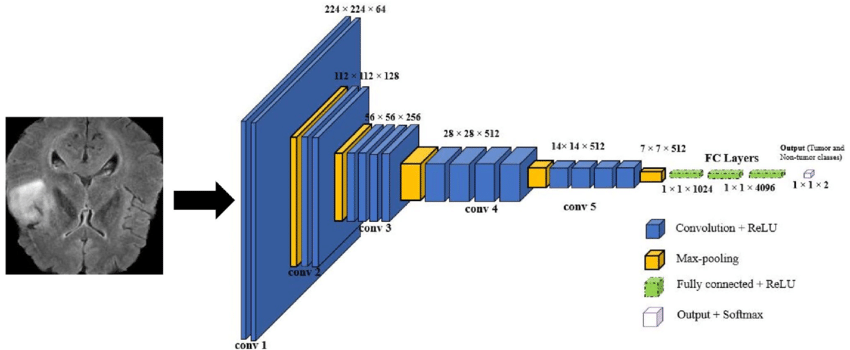
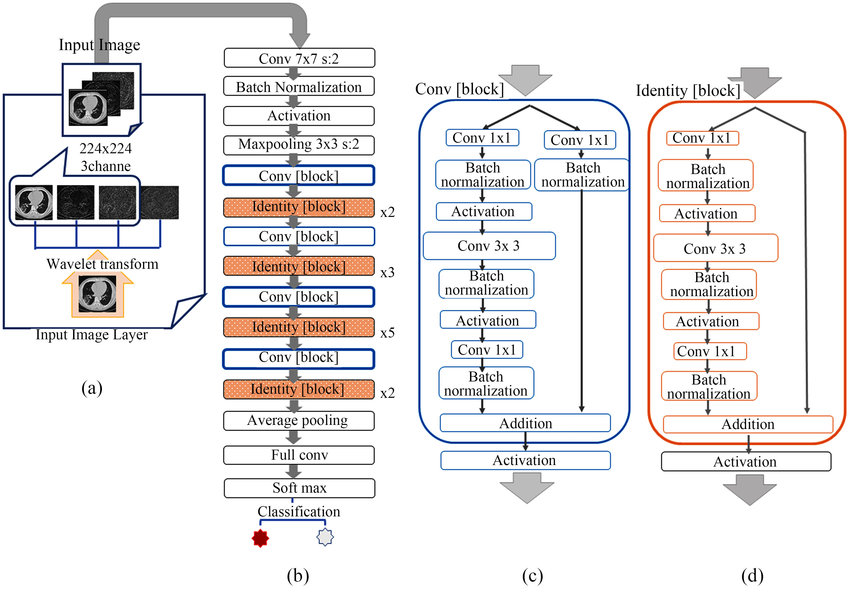
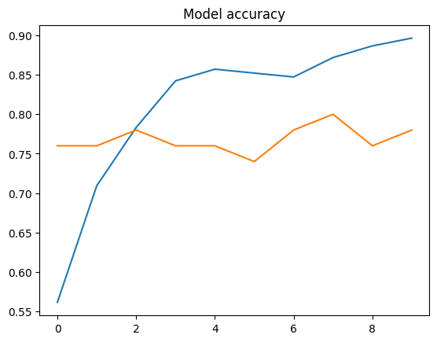
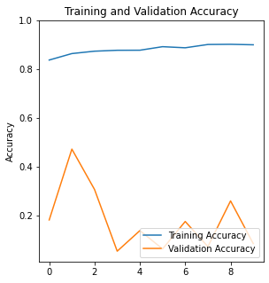

# CSE498R
### VGG19 Model implemented on tumor and Pneumonia segmentation.


### Resnet50 Model implemented Malariya detection.
 
### Dependencies intallation
```bash
pip install -r requirements.txt
```
It will install all the dependencies required for the project.

This Project is implemented on Google Colab. So, you can run the project on Google Colab. Select the GPU as the runtime type for faster execution.

#### Model 
All the model saved in Saved_model folder. You can download the model and use it for your project.

### Accuracy of the Model

This is for Brain tumor segmentation.


This is for Pneumonia segmentation.


