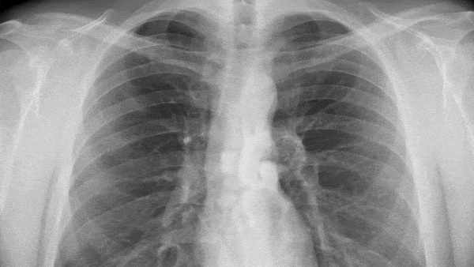

# CSE498R
### Brain Tumor Segmentation using MRI Images

### Penumonia Detection using Chest X-Ray Images


### Malariya Detection using Blood Cell Images

### Model Accuracy Table 
Tumor Segmentation VGG19 Resnet50 InceptionV3 InceptionResnetV2 Efficientnet-B7
| Model | Accuracy |
| --- | --- |
| VGG19 | 0.95 |
| Resnet50 | 0.68 |
| InceptionV3 | 0.92 |
| InceptionResnetV2 | 0.95 |
| Efficientnet-B7 | 0.82 |

Pneumonia Segmentation VGG19 Resnet50 InceptionV3 InceptionResnetV2 Efficientnet
| Model | Accuracy |
| --- | --- |
| VGG19 | 0.89 |
| Resnet50 | 0.90 |
| InceptionV3 | 0.93 |
| InceptionResnetV2 | 0.94 |
| Efficientnet | 0.74 |

Malariya Detection VGG19 Resnet50 InceptionV3 InceptionResnetV2 Efficientnet-B7
| Model | Accuracy |
| --- | --- |
| VGG19 | 0.50 |
| Resnet50 | 0.94 |
| InceptionV3 | 0.95 |
| InceptionResnetV2 | 0.91 |
| Efficientnet-B7 | 0.49 |

### Dependencies intallation

```bash
pip install -r requirements.txt
```
* Python 3.10
* Tensorflow 2.10

It will install all the dependencies required for the project.

This Project is implemented on Google Colab. So, you can run the project on Google Colab. Select the GPU as the runtime type for faster execution.

Drive : <https://drive.google.com/drive/folders/1ejXG6JWSSG5t5MoXvti1hDmi4SVu5qEw?usp=sharing>
